# 基于 Apache Doris 的小米增长分析平台实践

***1、背景\***

随着小米互联网业务的发展，各个产品线利用用户行为数据对业务进行增长分析的需求越来越迫切。显然，让每个业务产品线都自己搭建一套增长分析系统，不仅成本高昂，也会导致效率低下。我们希望能有一款产品能够帮助他们屏蔽底层复杂的技术细节，让相关业务人员能够专注于自己的技术领域，从而提高工作效率。通过分析调查发现，小米已有的统计平台无法支持灵活的维度交叉查询，数据查询分析效率较低，复杂查询需要依赖于研发人员，同时缺乏根据用户行为高效的分群工具，对于用户的运营策略囿于设施薄弱而较为粗放，运营效率较低和效果不佳。



基于上述需求和痛点，小米大数据和云平台联合开发了增长分析系统(Growing Analytics, 下面简称GA)，旨在提供一个灵活的多维实时查询和分析平台，统一数据接入和查询方案，帮助业务线做精细化运营。



***2、增长分析场景介绍\***



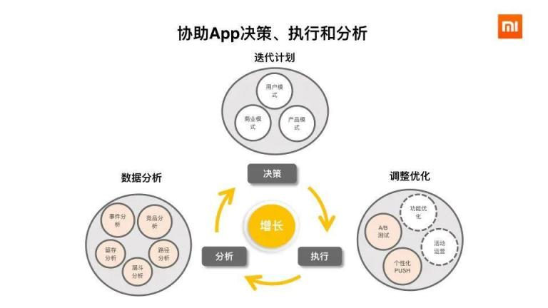

[24264162-be4a33da995fe293960×540 36.9 KB](https://forum.dorisdb.com/uploads/default/original/1X/41b231d2208793434081655ee44f0f3d772ddfa3.jpeg)



如上图所示，分析、决策、执行是一个循环迭代的过程，因此，增长分析查询非常灵活，涉及分析的维度有几十上百个，我们无法预先定义好所有要计算的结果，代价太高，所以这也就要求了所有的数据需要即时计算和分析。同时，决策具有时效性，因此数据从摄入到可以查询的时延不能太高。另外，业务发展迅速，需要增加新的分析维度，所以我们需要能够支持schema的变更（主要是在线增加字段）。



在我们的业务中，增长分析最常用的三个功能是事件分析（占绝大多数）、留存分析和漏斗分析；这三个功能业务都要求针对实时入库（只有append）的明细数据，能够即席选择维度和条件（通常还要join业务画像表或者圈选的人群包），然后在秒级返回结果（业界相关的产品如神策、GrowingIO等都能达到这个性能）。一些只支持提前聚合的预计算引擎（如Kylin），虽然查询性能优秀，但难以支持schema随时变更，众多的维度也会造成Cube存储占用失控，而Hive能够在功能上满足要求，但是性能上较差。



综上，我们需要存储和计算明细数据，需要一套支持近实时数据摄取，可灵活修改schema和即席查询的数据分析系统解决方案。



***3、技术架构演进\***

***3.1 初始架构\***

GA立项于2018年年中，当时基于开发时间和成本，技术栈等因素的考虑，我们复用了现有各种大数据基础组件(HDFS, Kudu, SparkSQL等)，搭建了一套基于Lamda架构的增长分析查询系统。GA系统初代版本的架构如下图所示：



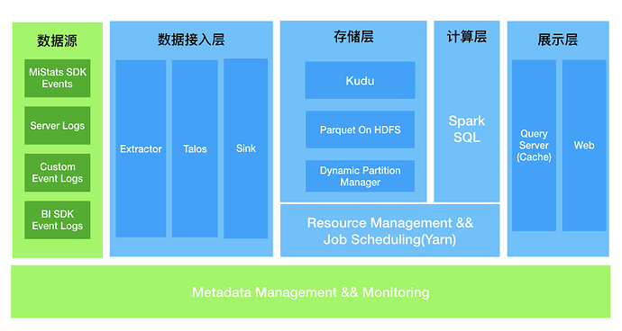

[24264162-a71af0c4c9704e311011×540 83.9 KB](https://forum.dorisdb.com/uploads/default/original/1X/20f6df314b39e8e4f9fe05cd25628380bea85f84.png)



GA系统涵盖了数据采集、数据清洗、数据查询和BI报表展示等一整套流程。首先，我们将从数据源收集到的数据进行统一的清洗，以统一的json格式写入到Talos(注：小米自研的消息队列)中。接着我们使用Spark Streaming将数据转储到Kudu中。Kudu作为一款优秀的OLAP存储引擎，具有支持实时摄取数据和快速查询的能力，所以这里将Kudu作为热数据的存储，HDFS作为冷数据的存储。为了不让用户感知到冷热数据的实际存在，我们使用了动态分区管理服务来管理表分区数据的迁移，定期将过期的热数据转化为冷数据存储到HDFS上，并且更新Kudu表和HDFS表的联合视图，当用户使用SparkSQL服务查询视图时，计算引擎会根据查询SQL自动路由，对Kudu表的数据和HDFS表的数据进行处理。



在当时的历史背景下，初代版本的GA帮助我们用户解决了运营策略较为粗放、运营效率较低的痛点，但同时也暴露了一些问题。首先是运维成本的问题，原本的设计是各个组件都使用公共集群的资源，但是实践过程中发现执行查询作业的过程中，查询性能容易受到公共集群其他作业的影响，容易抖动，尤其在读取HDFS公共集群的数据时，有时较为缓慢，因此GA集群的存储层和计算层的组件都是单独搭建的。另一个是 **性能** 的问题，SparkSQL是基于批处理系统设计的查询引擎，在每个Stage之间交换数据shuffle的过程中依然需要落盘操作，完成SQL查询的时延较高。为了保证SQL查询不受资源的影响，我们通过添加机器来保证查询性能，但是实践过程中发现，性能提升的空间有限，这套解决方案并不能充分地利用机器资源来达到高效查询的目的，存在一定的资源浪费。因此，我们希望有一套新的解决方案，能够提高查询性能和降低我们的运维成本。



***3.2 重新选型\***

MPP架构的SQL查询引擎，如Impala,presto等能够高效地支持SQL查询，但是仍然需要依赖Kudu, HDFS, Hive Metastore等组件, 运维成本依然比较高，同时，由于计算存储分离，查询引擎不能很好地及时感知存储层的数据变化，就无法做更细致的查询优化，如想在SQL层做缓存就无法保证查询的结果是最新的。因此，我们的目标是寻求一款计算存储一体的MPP数据库来替代我们目前的存储计算层的组件。我们对这款MPP数据库有如下要求:

1. 足够快的查询性能。
2. 对标准SQL支持较全面，用户使用友好。
3. 不依赖其他外部系统，运维简单。
4. 社区开发活跃，方便我们后续的维护升级。



Doris是百度开源到Apache社区的基于 MPP 的交互式 SQL 数据仓库， 主要用于解决报表和多维分析。它主要集成了 Google Mesa 和 Cloudera Impala 技术，满足了我们的上述要求。我们对Doris进行了内部的性能测试并和社区沟通交流，确定了Doris替换原来的计算存储组件的解决方案，于是我们新的架构就简化为如下图所示：



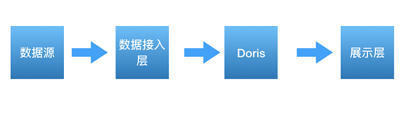

[24264162-bf6c7565dbd57eb3787×217 26.9 KB](https://forum.dorisdb.com/uploads/default/original/1X/282688489d21e7d66019326c556f7412d1b22421.png)



***3.3 性能测试\***

在配置大体相同计算资源的条件下，我们选取了一个日均数据量约10亿的业务，分别测试不同场景下（6个事件分析，3个留存分析，3个漏斗分析），不同时间范围（一周到一个月）的SparkSQL和Doris的查询性能。



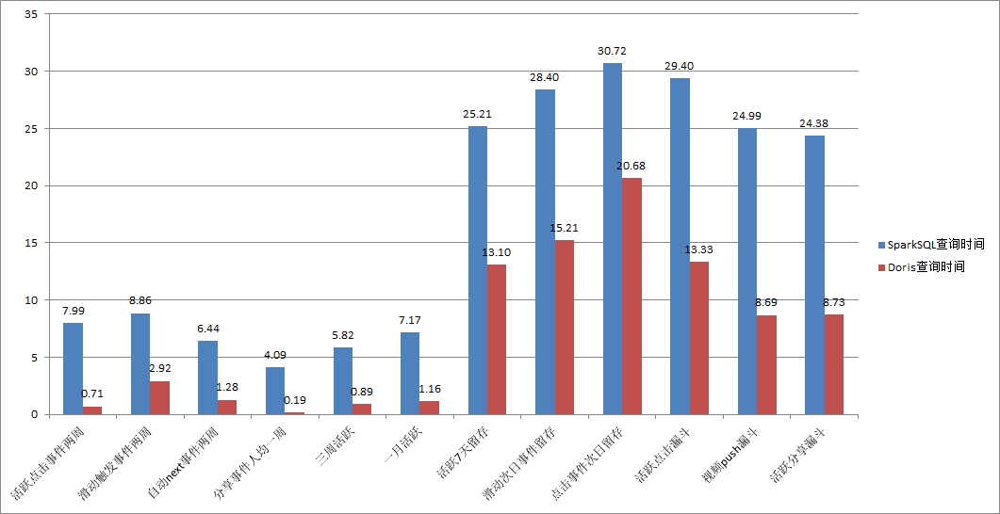

[24264162-6af8225416912cb71061×546 11.3 KB](https://forum.dorisdb.com/uploads/default/original/1X/822009acd1739b9faf6fe0a6c0b63a3461952fe8.png)



如上图测试结果，在增长分析的场景下，Doris查询性能相比于SparkSQL+Kudu+HDFS方案具有明显的提升，在事件分析场景下平均降低约85%左右的查询时间，在留存和漏斗场景下平均降低约50%左右的查询时间。对于我们我们业务大多数都是事件分析需求来讲，这个性能提升很大。



***4、Doris实践与优化\***

***4.1 Doris在增长分析平台的使用情况\***



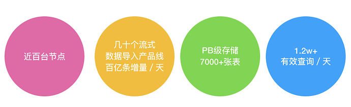

[24264162-2a96ac54f6206b68923×281 57.5 KB](https://forum.dorisdb.com/uploads/default/original/1X/79dcfa0da4711bcd27303ef758b556ae35a68cc6.png)



随着接入业务的增多，目前，我们的增长分析集群单集群最大规模已经扩展到了近百台，存量数据到了PB级别。其中，近实时的产品线作业有数十个，每天有几百亿条的数据入库，每日有效的业务查询SQL达1.2w+。业务的增多和集群规模的增大，让我们也遇到不少问题和挑战，下面我们将介绍运维Doris集群过程中遇到的一些问题和应对措施或改进。



***4.2 Doris数据导入实践\***

Doris大规模接入业务的第一个挑战是数据导入，基于我们目前的业务需求，数据要尽可能实时导入。而对于增长分析集群，目前有数十个业务明细数据表需要近实时导入，这其中还包含了几个大业务(大业务每天的数据条数从几十亿到上百亿不等，字段数在200~400)。为了保证数据不重复插入，Doris采用label标记每批数据的导入，并采用两阶段提交来保证数据导入的事务性，要么全部成功，要么全部失败。为了方便监控和管理数据导入作业，我们使用Spark Streaming封装了stream load操作，实现了将Talos的数据导入到Doris中。每隔几分钟，Spark Streaming会从Talos读取一个批次的数据并生成相应的RDD，RDD的每个分区和Talos的每个分区一一对应，如下图所示：



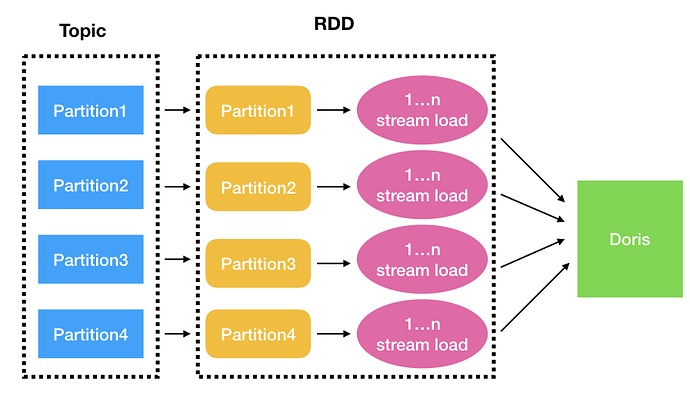

[24264162-1380e0f17b3f32a4897×514 83.2 KB](https://forum.dorisdb.com/uploads/default/original/1X/23011d6ff2ff4b7e2aa68494f0ed5e07f82c72c2.png)



对于Doris来说，一次stream load作业会产生一次事务，Doris的fe进程的master节点会负责整个事务生命周期的管理，如果短时间内提交了太多的事务，则会对fe进程的master节点造成很大的压力。对于每个单独的流式数据导入产品线作业来说，假设消息队列一共有m个分区，每批次的每个分区的数据导入可能执行最多n次stream load操作，于是对消息队列一个批次的数据的处理就可能会产生m*n次事务。为了Doris的数据导入的稳定性，我们把Spark Streaming每批次数据的时间间隔根据业务数据量的大小和实时性要求调整为1min到3min不等，并尽量地加大每次stream load发送的数据量。



在集群接入业务的初期，这套流式数据导入Doris的机制基本能平稳运行。但是随着接入业务规模的增长，问题也随之而来。首先，我们发现某些存了很多天数据的大表频繁地出现数据导入失败问题，具体表现为数据导入超时报错。经过我们的排查，确定了导致数据导入超时的原因，由于我们使用stream load进行数据导入的时候，没有指定表的写入分区(这里线上的事件表都是按天进行分区)，有的事件表已经保留了三个多月的数据，并且每天拥有600多个数据分片，加上每张表默认三副本保存数据，所以每次写入数据之前都需要打开约18万个writer，导致在打开writer的过程中就已经超时，但是由于数据是实时导入，其他天的分区没有数据写入，所以并不需要打开writer。定位到原因之后，我们做了相应的措施，一个是根据数据的日期情况，在数据导入的时候指定了写入分区，另一个措施是缩减了每天分区的数据分片数量，将分片数据量从600+降低到了200+(分片数量过多会影响数据导入和查询的效率)。通过指定写入数据分区和限制分区的分片数量，大表也能流畅稳定地导入数据而不超时了。



另一个困扰我们的问题就是需要实时导入数据的业务增多给fe的master节点带来了较大的压力，也影响了数据导入的效率。每一次的 stream load操作，coordinator be节点都需要多次和fe节点进行交互，如下图所示：



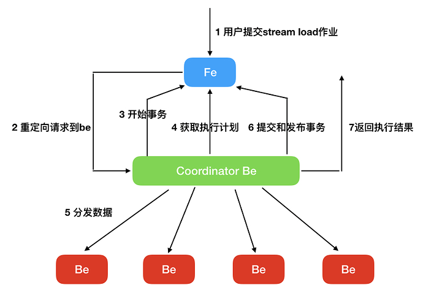

[24264162-712bfa3a32bfd4e0816×566 48.9 KB](https://forum.dorisdb.com/uploads/default/original/1X/9e94e79a46e360c06a6aa1c73f409ffd1fa69c49.png)



曾经有段时间，我们发现master节点偶尔出现线程数飙升，随后cpu load升高, 最后进程挂掉重启的情况。我们的查询并发并不是很高，所以不太可能是查询导致的。但同时我们通过对max_running_txn_num_per_db参数的设置已经对数据导入在fe端做了限流，所以为何fe的master节点的线程数会飙升让我们感到比较奇怪。经过查看日志发现，be端有大量请求数据导入执行计划失败的日志。我们的确限制住了单个db能够允许同时存在的最大事务数目，但是由于fe在计算执行计划的时候需要获取db的读锁，提交和完成事务需要获取db的写锁，一些长尾任务的出现导致了好多计算执行计划的任务都堵塞在获取db锁上边，这时候be客户端发现rpc请求超时了，于是立即重试，fe端的thirft server需要启动新的线程来处理新的请求，但是之前的事务任务并没有取消，这时候积压的任务不断增多，最终导致了雪崩效应。针对这种情况，我们对Doris主要做了以下的改造：

1. 在构造fe的thrift server的线程池时使用显式创建线程池的方式而非原生的newCachedThreadPool方式，对线程数做了相应的限制，避免因为线程数飙升而导致资源耗尽，同时添加了相应的监控。
2. 当be对fe的rpc请求超时时，大部分情况下都是fe无法在指定时间内处理完请求导致的，所以在重试之前加上缓冲时间，避免fe端处理请求的堵塞情况进一步恶化。
3. 重构了下GlobalTransactionMgr的代码，在保持兼容原有接口的基础上，支持db级别的事务隔离，尽量减少不同事务请求之间的相互影响，同时优化了部分事务处理逻辑，加快事务处理的效率。
4. 获取db锁添加了超时机制，如果指定时间内获取不到db锁，则取消任务，因为这时候be端的rpc请求也已经超时了，继续执行取消的任务没有意义。
5. 对coordinator be每一步操作的耗时添加metric记录，如请求开始事务的耗时，获取执行计划的耗时等，在最终的执行结果中返回，方便我们及时了解每个stream load操作的耗时分布。



经过以上改造，我们数据导入稳定性有了比较好的提升，至今再没发生过因为fe处理数据导入事务压力过大而导致master节点挂掉的问题。但是数据导入依然存在一些问题待改进：

1. be端使用了libevent来处理http请求，使用了Reactor模式的libevent一般是编写高性能网络服务器的首选，但是这里却不适用于我们的场景，Doris在回调函数中多次地调用包含阻塞逻辑的业务代码，如rpc请求，等待数据分发完成等，由于多个请求共用同一个线程，这将部分请求的回调操作不能得到及时的处理。目前这块我们并没有好的解决方法，唯一的应对措施只是调大了libevent的并发线程数，以减弱不同请求之间的相互影响，彻底的解决方案仍有待社区的进一步讨论。
2. fe端在更新表的分区版本时采用了db级别的隔离，这个锁的粒度过大，导致了相同db不同表的数据导入都要竞争db锁，这大大降低了fe处理事务的效率。
3. 发布事务的操作现在依然比较容易出现publish timeout的问题（这意味着无法在指定时间内得到大多数事务相关be节点完成发布事务操作的响应），这对数据导入的效率提升是一个比较大的阻碍。



***4.3 Doris在线查询实践\***

在增长分析业务场景中，事件表是我们的核心表，需要实时导入明细日志。这些事件表没有聚合和去重需求，而且业务需求是能够查询明细信息，所以都选用了冗余模型（DUPLICATE KEY）。事件表根据天级别分区，分桶字段使用了日志id字段（实际上是一个随机产生的md5），其hash值能够保证分桶之间数据均匀分布，避免数据倾斜导致的写入和查询问题。

下图是我们线上规模最大的集群最近30天的查询性能统计（查询信息的统计来自于Doris的查询审计日志），最近一周每天成功的SQL查询数在1.2w~2w之间。



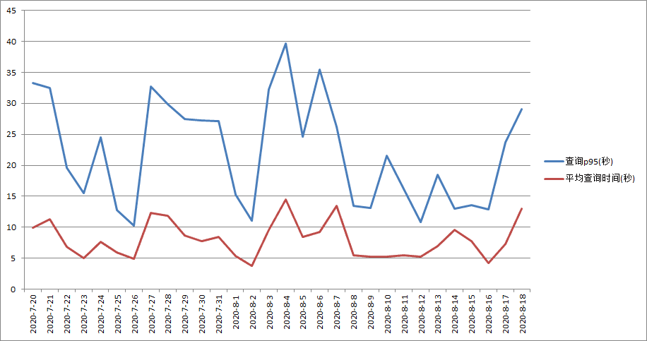

[24264162-7cc1bbe373eaa09b916×483 11.6 KB](https://forum.dorisdb.com/uploads/default/original/1X/125d367fde9f3d31a89508d4ab18408ff89ea653.png)



从图中可以看出，使用了Doris后，平均查询时间保持在10秒左右，最大不超过15秒；查询时间P95一般能保证在30秒内。这个查询体验，相对于原来的SparkSQL，提升效果比较明显。

Doris提供了查询并发度参数parallel_fragment_exec_instance_num，查询服务端根据正在运行的任务个数动态调整它来优化查询，低负载下增加并发度提高查询性能，高负载下减少并发度保证集群稳定性。在分析业务查询profile时，我们发现Doris默认执行过程中exchange前后并发度是一样的，实际上对于聚合型的查询，exchange后的数据量是大大减少的，这时如果继续用一样的并发度不仅浪费了资源，而且exchange后较少数据量用较大的并发执行，理论上反而降低了查询性能。因此，我们添加了参数doris_exchange_instances控制exchange后任务并发度（如下图所示），在实际业务测试中取得了较好的效果。



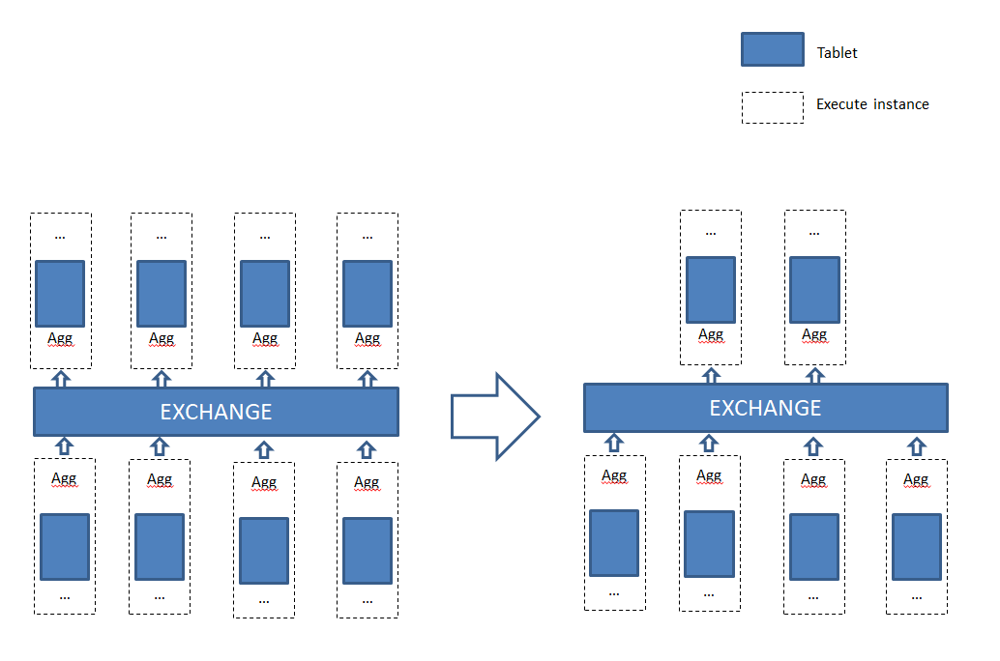

[24264162-0f0ecc04a8848b7b1034×684 14 KB](https://forum.dorisdb.com/uploads/default/original/1X/0193ef28ad766f42603a225cfee7d53becf320ab.png)



这个对数据量巨大的业务或者exchange后不能明显降低数据量级的查询并不明显，但是这个对于中小业务（尤其是那些用了较多bucket的小业务）的聚合或join查询，优化比较明显。我们对不同数量级业务的测试，也验证了我们的推断。我们选取了一个数据量4亿/日的小业务，分别测试了不同场景下查询性能：



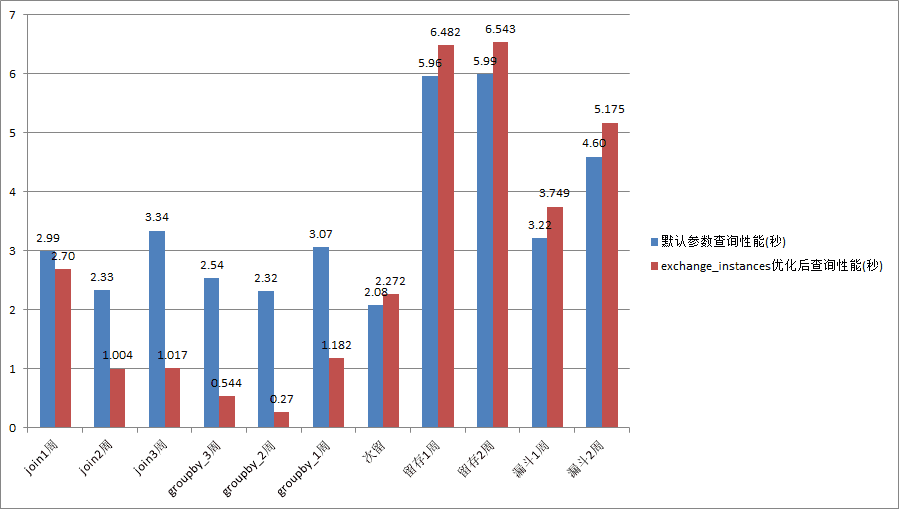

[24264162-373204a2d88d93d3899×509 8.24 KB](https://forum.dorisdb.com/uploads/default/original/1X/1f99ad9b0cde518bf19c404aa25de6987e0ba48e.png)



从上图结果可以看出，doris_exchange_instances对于聚合和join类型的小查询改进明显。当然，这个测试是在很多次测试之后找到的最优doris_exchange_instances值，在实际业务中每次都能找到最优值可行性较低，一般对于中小业务根据查询计划中需要扫描的buckets数目结合集群规模适当降低，用较小的代价获得一定性能提升即可。后来我们将这个改进贡献到社区，该参数名被修改为parallel_exchange_instance_num。

为了扩展SQL的查询能力，Doris也提供了和SparkSQL，Hive类似的UDF（User-Defined Functions）框架支持。当Doris内置函数无法满足用户需求时，用户可以根据Doris的UDF框架来实现自定义函数进行查询。Doris支持的UDF分成两类（目前不支持UDTF，User-Defined Table-Generating Functions，一行数据输入对应多行数据输出），一类是普通UDF，根据单个数据行的输入，产生一个数据行的输出。另一类是UDAF(User-Defined Aggregate Functions)，该类函数属于聚合函数，接收多个数据行的输入并产生一个数据行的输出。UDAF的执行流程如下图所示：



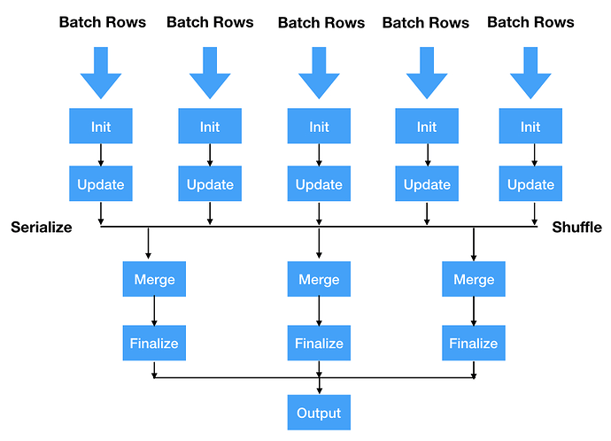

[24264162-40b4a38cc55c18fc966×698 57 KB](https://forum.dorisdb.com/uploads/default/original/1X/219c2a2e592fb2cac13da4c282b8eca4f65eda01.png)



UDAF一般需要定义4个函数，分别为Init、Update、Merge、Finalize函数，若为中间输出的数据类型为复杂数据类型时，则还需要实现Serialize函数，在Shuffle过程中对中间类型进行序列化，并在Merge函数中对该类型进行反序列化。在增长分析场景中，留存分析、漏斗分析等都使用到了UDAF。以留存分析为例，它是一种用来分析用户参与情况/活跃程度的分析模型，考查进行初始行为后的用户中有多少人会进行后续行为。针对以上需求，我们首先定义了函数retention_info，输入是每个用户的行为信息，然后以每个用户的id为key进行分组，生成每个用户在指定时间内的每个时间单元（如天，周，月等）的留存信息，然后定义函数retention_count，输入是retention_info函数生成的每个用户的留存信息，然后我们以留存的时间单位（这里通常是天）为key进行分组，就可以算出每个单位时间内留存的用户数。这样在UDAF的帮助下，我们就可以顺利完成留存分析的计算。



***4.4 Doris表的管理\***

在我们的增长分析场景中，从是否分区的角度上看，Doris的olap表主要分成两种类型，一种是非分区表，如人群包和业务画像表，人群包表的特征是数据量较小，但是表的数量多；业务画像表数据量较少，数据量中等，但有更新需求。另一种是分区表，如事件表，这类表一般单表数据规模都比较大，在设计上，我们以时间字段为分区键，需要每天增加为表添加新的分区，使得实时的数据能够成功地导入当天的分区，并且需要及时地删掉过期的分区。显然，让每个业务自己去管理表的分区，不仅繁琐，而且可能出错。在我们原先的GA架构中，就有动态分区管理服务，使用Doris系统后，我们将动态分区管理服务集成到了Doris系统中，支持用户按天、周、月来设置需要保留的分区个数以及需要提前创建的分区数量。



另一个表管理的典型场景是修改表的schema，主要操作为增加表的字段。Doris现阶段只支持一些基本数据类型，在大数据场景下业务打点上报的日志的数据类型多为嵌套类型（list，map），所以接入Doris时需要展开或者转换，导致Doris表字段数目较为庞大，部分类型字段展开困难不得不用varchar存储导致使用起来非常不方便，查询性能也相对低下。由于Doris不支持嵌套数据类型，当嵌套类型新增元素时，则Doris表需要增加字段，从提交增加字段请求到添加字段成功等待的时间较长，当集群管理的tablet数目庞大并且表的数据量和tablet数目都比较多的情况下可能会出现添加列失败的问题。针对以上问题，目前我们主要做了以下两点改进:

1. 缩短用户提交修改schema请求到真正执行的等待时长，当系统创建一个修改表的schema的事务的时候，原先的设计是要等待同一个db的所有大于该事务id号的事务都完成了才能开始修改表的schema，我们修改为等待与该表有关且在该事务id号之前的所有事务完成即可修改表的schema。当同一个db的数据导入作业很多的时候，这个修改可以大大缩短修改schema的等待时间，也避免了其他表的一些数据导入故障问题可能导致修改表schema的操作迟迟不能执行。
2. 加快创建表包含新的schema的tablet的速度。Doris修改schema的原理是通过创建包含新的schema的tablet，然后将旧的tablet的数据迁移到新的tablet来完成schema的修改。be节点通过一个map的数据结构来管理所有该节点上的tablet。由于这里只有一把全局锁，当tablet数量非常多的时候，一些管理tablet的操作都要去获取全局锁来对tablet进行操作，此时会导致创建新的tablet超时，使得修改schema的操作失败。针对这种情况，我们对map和全局锁做了shard操作，避免了创建tablet超时情况的发生。



***5、总结与展望\***

Doris在小米从2019年9月上线接入第一个业务至今，已经在海内外部署近十个集群（总体达到几百台BE的规模），每天完成数万个在线分析查询，承担了我们包括增长分析和报表查询在内的大多数在线分析需求。从结果上来看，用Doris替换SparkSQL作为主要OLAP引擎，既大幅度提高查询性能，又简化了目前的数据分析架构，是Doris基于明细数据查询的大规模服务的一个比较成功的实践。



在接下来的一段时间内，我们将继续投入精力提升数据实时导入效率和优化总体的查询性能，由于公司内部有不少业务有使用UNIQUE KEY模型的需求，目前该模型与DUPLICATE KEY模型的scan性能相比还是有比较明显的差距，这块也是未来我们需要重点解决的性能问题。



***6、致谢\***

随着社区的发展，Doris正在变得成熟和完善。Doris核心研发团队的成员组建了鼎石科技，他们专注于提升Doris的性能和完善Doris的相关功能，如可视化管理运维平台，安全性组件等。在使用Doris的过程中，鼎石科技的小伙伴们也给予了我们很大的帮助，特此感谢！



***7、作者简介\***

蔡聪辉，小米OLAP工程师，Apache Doris Committer

钟云，小米大数据工程师