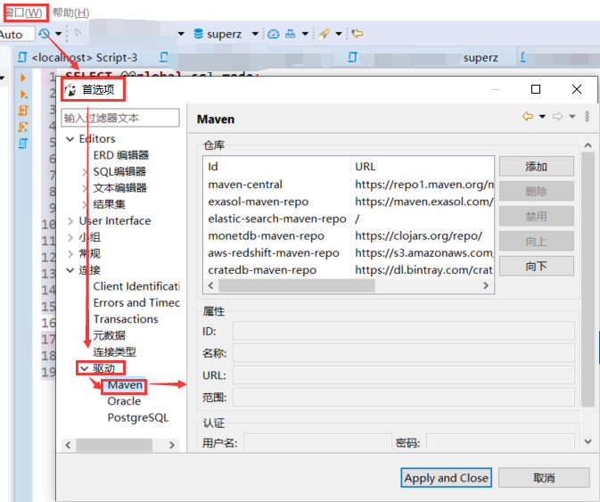

<!--
 * @Github       : https://github.com/superzhc/BigData-A-Question
 * @Author       : SUPERZHC
 * @CreateDate   : 2020-12-16 13:54:32
 * @LastEditTime : 2020-12-16 14:02:21
 * @Copyright 2020 SUPERZHC
-->
# 设置 Maven

`Window(窗口) -> Preferences(首选项) -> Drivers(驱动) -> Maven`

## 配置阿里云仓库

| id       | name         | url                                                    |
| -------- | ------------ | ------------------------------------------------------ |
| alimaven | aliyun maven | <http://maven.aliyun.com/nexus/content/groups/public/> |