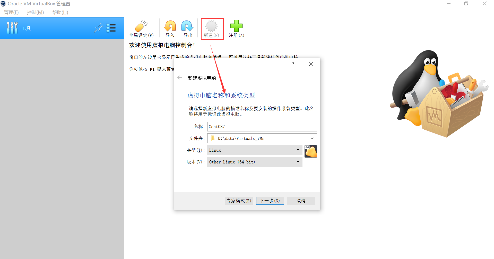

# VirtualBox

- 官网地址：<https://www.virtualbox.org/>
- 下载地址：<http://download.virtualbox.org/virtualbox/>

## 安装

### Windows 版本

下载 virtual box 主程序：


## 安装系统

### 初始化虚拟机

打开 VirtualBox，点击新建



> 注：名称和虚拟机文件存放路径根据用户的需要自行进行设置

**分配内存**


**虚拟硬盘**


创建，直接使用默认即可


**存储在物理硬盘上**


### 安装操作系统

**关联操作系统**

选中创建的虚拟机，点击设置，选择存储，在控制器里选择下载好的操作系统：


**启动虚拟机**


**安装操作系统**

此步骤跟正常安装操作系统是一样的。

> 网络设置，注意不要直接默认使用无网络连接，点击 NETWork & HOST NAME 进行设置：打开网络

## 网络连接

VirtualBox 有四种网络连接方式：

1. NAT：Network Address Translation，网络地址转换
   ```
   Guest 访问网络的所有数据都是由主机提供的，Guest 并不真实存在于网络中，主机与网络中的任何机器都不能查看和访问到 Guest 的存在。
   Guest 可以访问主机能访问到的所有网络，但是对于主机以及主机网络上的其他机器，Guest 又是不可见的，甚至主机也访问不到 Guest。
   ```

   - 虚拟机与主机的关系：只能单向访问，虚拟机可以通过网络访问到主机，主机无法通过网络访问到虚拟机。
   - 虚拟机与网络中其他主机的关系：只能单向访问，虚拟机可以访问到网络中其他主机，其他主机不能通过网络访问到虚拟机。
   - 虚拟机与虚拟机的关系：相互不能访问，虚拟机与虚拟机各自完全独立，相互间无法通过网络访问彼此。
2. Bridged Adapter：网桥模式
   ```
   它是通过主机网卡，架设了一条桥，直接连入到网络中了。因此，它使得虚拟机能被分配到一个网络中独立的IP，所有网络功能完全和在网络中的真实机器一样。
   网桥模式下的虚拟机，把它认为是真实计算机就行了。
   ```
   
   - 虚拟机与主机的关系：可以相互访问，因为虚拟机在真实网络段中有独立 IP，主机与虚拟机处于同一网络段中，彼此可以通过各自 IP 相互访问。
   - 虚拟机与网络中其他主机的关系：可以互相访问，同样因为虚拟机在真实网络段中有独立 IP，虚拟机与所有网络其他主机处于同一网络段中，彼此可以通过各自 IP 互相访问。
   - 虚拟机与虚拟机的关系：可以互相访问，原因同上。
3. Internal：内网模式
   ```
   虚拟机与外网完全断开，只实现虚拟机与虚拟机之间的内部网络模式。
   ```

   - 虚拟机与主机的关系：不能相互访问，彼此不属于同一个网络，无法相互访问。
   - 虚拟机与网络中其他主机的关系：不能相互访问，理由同上。
   - 虚拟机与虚拟机的关系：可以相互访问，前提是在设置网络时，两台虚拟机设置同一网络名称。
4. Host-only Adapter：主机模式
   - 虚拟机与主机的关系：默认不能相互访问，双方不属于同一IP段，host-only网卡默认IP段为192.168.56.X 子网掩码为255.255.255.0，后面的虚拟机被分配到的也都是这个网段。通过网卡共享、网卡桥接等，可以实现虚拟机与主机相互访问。
   - 虚拟机与网络主机的关系：默认不能相互访问，原因同上，通过设置，可以实现互相访问。
   - 虚拟机与虚拟机的关系：默认可以相互访问，都是同处于一个网段。

四种连接方式的区别：


VirtualBox 默认的网络连接方式如下：


### 当宿主机插网线(以太网)时的虚拟机网络设置

左边是宿主机的网络设置，右边是虚拟机网络设置，修改虚拟机的连接方式为桥接网卡、界面名称处选择的是宿主机当前使用的网卡


虚拟机网络修改完成后，查看宿主机网络信息：


启动虚拟机，输入 `ip address` 命令：


默认情况下，虚拟机会根据宿主的网卡信息自动分配一个 IP，上图显示了 IP/子网掩码信息和以太网卡的名称(根据这个名称可以在 `/etc/sysconfig/network-scripts/` 下找到相应的网络配置文件)。

经过以上步骤，虚拟机可以与宿主机互相ping通了。

### 当宿主机 wifi 时的虚拟机网络设置

**网卡 1**


**网卡 2**


连接方式为仅主机(Host-Only)网络，界面名称选择 VirtualBox 安装后自动生成的以太网卡适配器，用于与宿主机通信