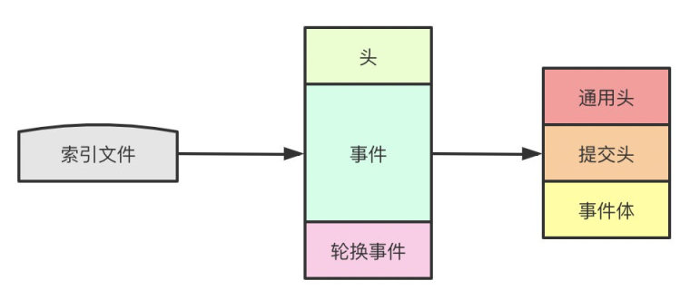

# 日志文件

日志文件记录了影响 MySQL 数据库的各种类型活动。MySQL 数据库中常见的日志文件有：
- 错误日志（error log）
- 二进制日志（binlog）
- 慢查询日志（slow query log）
- 查询日志（log）

这些日志可以帮助用户对 MySQL 数据库的运行状态进行诊断，从而更好地进行数据库层面地优化。

## 错误日志

错误日志文件对 MySQL 的启动、运行、关闭过程进行了记录。用户在遇到问题时应该首先查看该文件以便定位问题。该文件不仅记录了所有的错误信息，也记录一些警告信息或正确的信息。用户可以**通过命令 `SHOW VARIABLES LIKE 'log_error'` 来定位该文件**。

当出现 MySQL 数据库不能正常启动时，第一个必须查找的文件应该就是错误日志文件，该文件记录了错误信息，能很好地指导用户发现问题。

## 慢查询日志

慢查询日志（slow log）可帮助用户定位可能存在问题的 SQL 语句，从而进行 SQL 语句层面的优化。例如，可以在 MySQL 启动时设一个阈值，将运行时间超过该值的所有 SQL 语句都记录到慢查询日志文件中，用户每天或没过一段时间对其进行检查，确认是否有 SQL 语句需要进行优化。

在默认情况下，MySQL 数据库并不启动慢查询日志，用户需要手动开启，**查看是否开启的命令为 `SHOW VARIABLES LIKE 'log_slow_queries';`**。

MySQL 会通过参数 `long_query_time` 来设置慢查询的阈值，当运行时间超过该值的所有 SQL 语句都会被记录，但运行时间正好等于阈值的情况并不会被记录。

用户通过慢查询日志来找出有问题的 SQL 语句，对其进行优化。然而随着 MySQL 数据库服务器运行时间的增加，可能会有越来越多的 SQL 查询被记录到了慢查询日志文件中，此时要分析该文件就显得不是那么简单和直观了。因此 Mysql 数据库提供了工具 **mysqldumpslow 命令**，可以很好的帮助用户解决该问题：

```sh
mysqldumpslow slow.log
```

从 MySQL 5.1 开始可以将慢查询的日志记录放入一张表中，这使得用户查询更加方便和直观。慢查询表在 mysql 数据库下，名为 slow_log。

参数 `log_output` 指定了慢查询输出的格式，默认为 FILE，可以将它设为 TABLE，然后就可以查询 mysql 数据库下的 slow_log 表了。参数 `log_output` 是动态的，并且是全局的，因此用户可以在线进行修改。

MySQL 的慢查询日志通过运行时间来对 SQL 语句进行捕获，这是一个非常有用的优化技巧，但是当数据库的容量较小的时，此时非常大的可能是数据全部被缓存在缓冲池中，SQL 语句运行的时间可能都是非常短的，一般都是 0.5 秒。

## 查询日志

查询日志记录了所有对 MySQL 请求的信息，无论这些请求是否得到了正确的执行，默认文件名为 `主机名.log`

从 MySQL 5.1 开始，可以将查询日志的记录放入 mysql 数据库下的 general_log 表中。

## binlog-二进制日志

二进制日志（binary log）记录了对 MySQL 数据库执行更改的所有操作，但是不包括 SELECT 和 SHOW 这类操作，因为这类操作对数据本身并没有修改，然而，若操作本身并没有导致数据库发生变化，那么该操作可能也会被写入二进制日志。例如：

```sql
-- 没有 c=2 的记录
update t set a=1 where c=2;
```

如果用户想记录 SELECT 和 SHOW 操作，那只能使用查询日志，而不是二进制日志。此外，二进制日志还包括了执行数据库更改操作的时间等其他额外信息。

总的来说，二进制日志主要有以下几种作用：
- **恢复（recovery）**：某些数据的恢复需要二进制日志，例如，在一个数据库全备文件恢复后，用户可以通过二进制日志进行 point-in-time 恢复
- **复制（replication）**：其原理与恢复类似，通过复制和执行二进制日志使一台远程的 MySQL 数据库（一般称为 slave 或 standby）与一台 MySQL 数据库（一般称为 master 或 primary）进行实时同步
- **审计（audit）**：用户可以通过二进制日志中的信息来进行审计，判断是否有对数据库进行注入的攻击

二进制日志文件在默认情况下并没有启动，需要手动指定参数来启动。

二进制日志文件的文件格式为二进制，不能像错误日志文件、慢查询日志文件那样用 cat、head、tail 等命令来查看。要查看二进制日志文件的内容，必须通过 MySQL 提供的工具`mysqlbinlog`。

**示例**

```sql
-- 查看binlog列表
show binary logs;
-- 查看最新的binlog
show master status;

-- 查看binlog，若不带in则只会查询到第一个binlog，并不是当前激活状态的binlog
show binlog events in 'bin.003226';

-- 结果说明：
-- Log_name代表日志文件的名称
-- Pos代表文件开始的位置
-- Event_type代表事件的类型
-- Server_id是创建事件的服务器ID
-- End_log_pos代表事件在文件中的结束位置
-- info代表事件信息，是一段可读的文本内容
```

binlog 日志由索引文件和 binlog 文件组成，如下图所示：



索引文件每一行都包含了一个 binlog 文件的完整文件名。

每个 binlog 文件以若干个 binlog 事件组成，以格式描述事件(Format_description)作为文件头(上面的 binlog 图片 Format_desc 事件)，以日志轮换事件(rotate)作为文件尾。

Format_description 包含 binlog 文件的服务器信息、文件状态的关键信息等。如果服务器关闭或者重启，则会创建一个新的 binlog 文件，同时写入一个新的 Format_description。