<!--
 * @Github       : https://github.com/superzhc/BigData-A-Question
 * @Author       : SUPERZHC
 * @CreateDate   : 2020-12-01 23:14:55
 * @LastEditTime : 2020-12-08 16:44:34
 * @Copyright 2020 SUPERZHC
-->
# 函数

**函数**是将一个对象转化为另一个对象的规则。起始对象称为**输入**，来自称为**定义域**的集合；返回对象称为**输出**，来自称为**上域**的集合。

一个函数必须给每一个有效的输入指定唯一的输出。

设 x 和 y 是两个变量，D 是一个非空数集。如果按照某个法则 f，对每个数 $x \in D$，变量 y 总有唯一确定的值与之对应，则称此对应法则 f 为定义在 D 上的函数，与 x 对应的值 y 称为 f 在 x 处的函数值，记作 $f(x)$，即 $y=f(x)$。变量 x 称为自变量，y 称为因变量。数集 D 称为定义域，$W=\left \{ y | y=f(x),x \in D \right \}$ 称为函数的值域。

## 基本初等函数

像幂函数、指数函数、对数函数、三角函数以及反三角函数等，统称为 **基本初等函数**。

### 幂函数

$$
y=x^{\alpha} (\alpha 是常数)
$$

当 $a \in Z^{+}$ 时，$y=x^{\alpha}$ 的定义域是 $R$；当 $a \in Z^{-}$ 时，$y=x^{\alpha}$ 的定义域是 $R \setminus \left \{ 0 \right \}$。

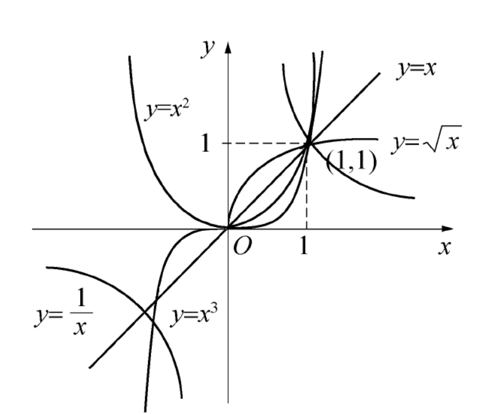

### 指数函数

$$
y=a^{x} (a>0,a \neq 1)
$$

对于任意 x，$a^x>0$，且 $a^0=1$，故质数函数的图像在 x 轴的上方，且通过点(0,1)

当 `a>1` 时，$y=a^{x}$ 是单调增加函数，如下图所示：

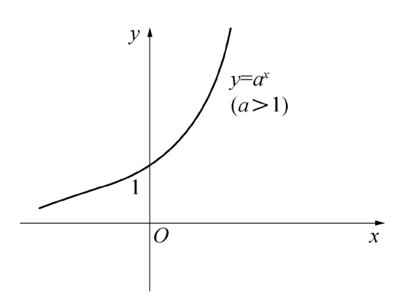

当 `0<a<1` 时，$y=a^{x}$ 是单调减少函数，如下图所示：

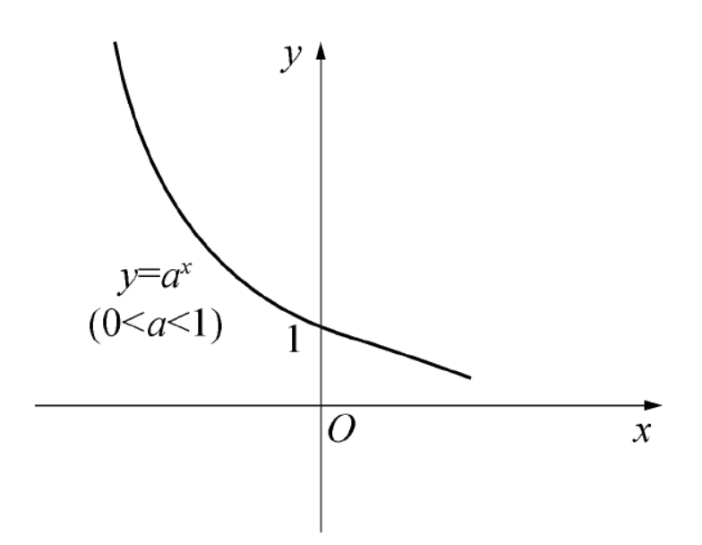

### 对数函数

$$
y=\log_{a}x (a>0,a \neq 1)
$$

对数函数的定义域是 $(0,+\infty)$，其图像位于 y 轴的右方且通过点 (1,0)。

当 `a>1` 时，$y=\log_{a}x$ 是单调增加函数，如下图所示：

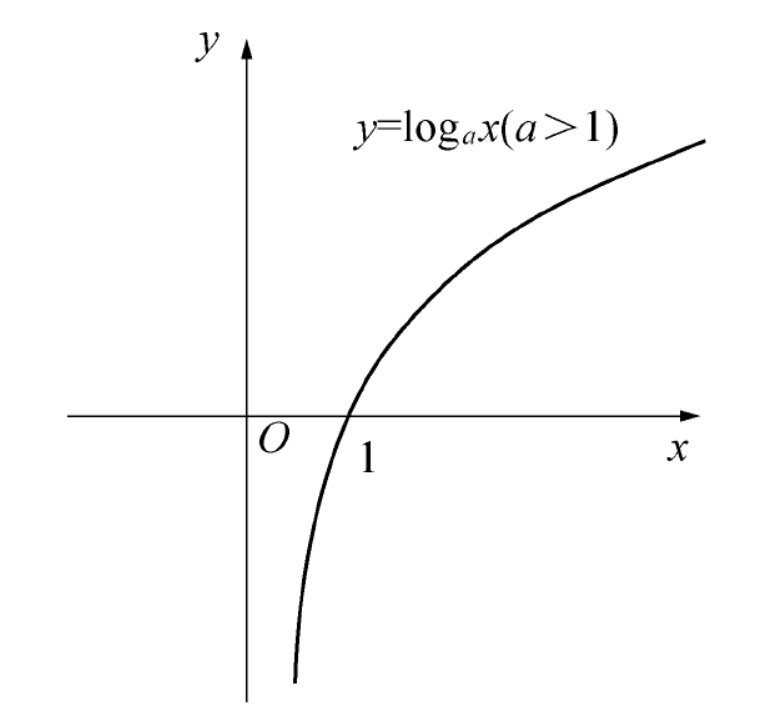

当 `0<a<1` 时，$y=\log_{a}x$ 是单调减少的函数，如下图所示：

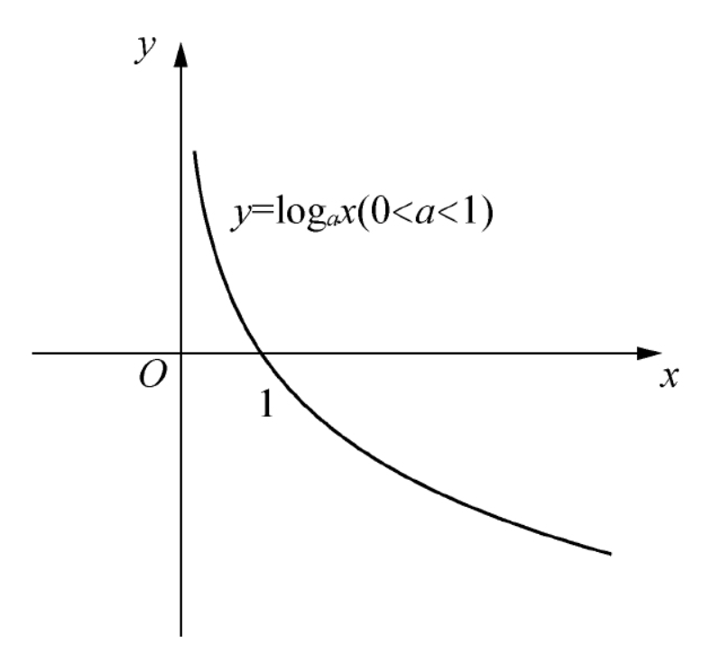

当 `a=e` 时的对数函数记为 $y=\ln x$，称为 **自然对数函数**。

对数具有以下运算性质：对任意的 $x,y \in R^{+},a>0,a \neq 1,b \in R$

1. $\log_ax+\log_ay=\log_axy$
2. $\log_ax-\log_ay=\log_a\frac{x}{y}$
3. $\log_ax^b=b\log_ax$

$y=\log_ax$ 和 $y=a^x$ 互为反函数，它们的图像关于直线 $y=x$ 对称，且有 $a^{\log_ax}=x$

### 三角函数

**圆周率**

圆周率 $\pi$ 是圆的周长与直径的比值，即 `圆周率=周长/直径`，

$$
\pi = \frac{C}{D} = \frac{C}{2R}
$$

**勾股定理**

勾股定理是一个基本的几何定理，指直角三角形的斜边的平方（直角相对的边）等于两条直角边的平方和。

$$
A^2 + B^2 = C^2
$$

**弧度**

半径为 1 个单位的圆的周长是 $2 \pi$ 个单位。事实上，这个圆的一个扇形的弧长就是这个扇形的圆心角的弧度，如下图所示：

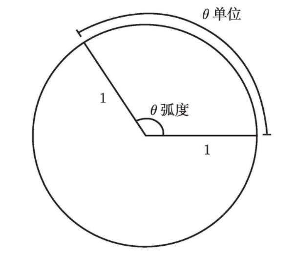

角在度与弧度之间的转换如下图所示：

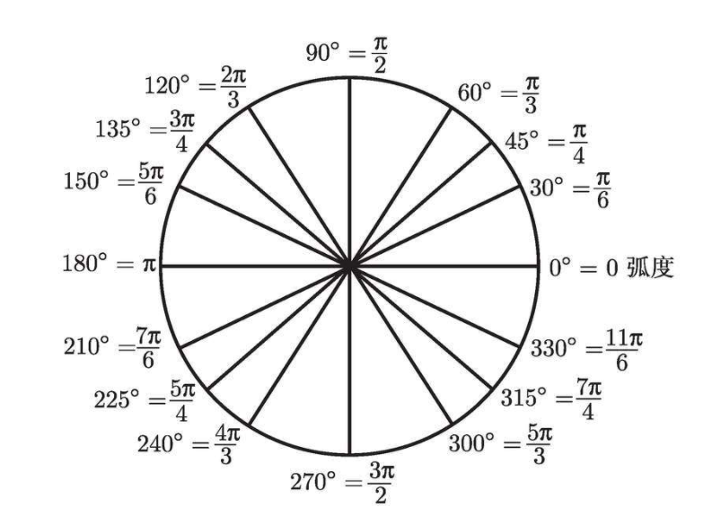

更一般地，如果需要的话，也可以使用公式

**三角函数**

正弦函数 $y=\sin x$，余弦函数 $y= \cos x$，正切函数 $y= \tan x$，余切函数 $y=\cot x$，正割函数 $y= \sec x$ 和余割函数 $y=\csc x$ 统称为 **三角函数**。

$$
\sin( \theta ) = \frac{对边}{斜边}\\
\cos( \theta ) = \frac{邻边}{斜边}\\
\tan( \theta ) = \frac{对边}{邻边}
$$

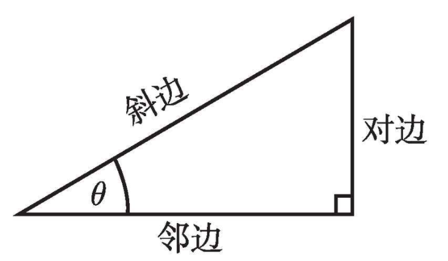

余割、正割和余切这些倒数函数，它们的定义分别为

$$
\csc(x)=\frac{1}{sin(x)}\\
\sec(x)=\frac{1}{cos(x)}\\
\cot(x)=\frac{1}{tan(x)}
$$

$y = \sin x$ 的定义域是R，值域是 $[-1，1]$，最小正周期是 $2 \pi$，它是奇函数：

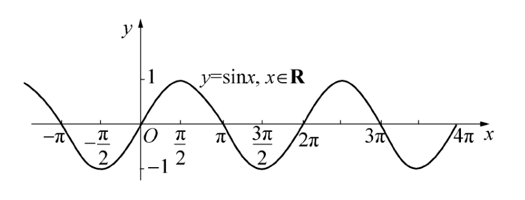

$y = \cos x$ 的定义域是R，值域是 $[-1，1]$，最小正周期是 $2 \pi$，它是偶函数：

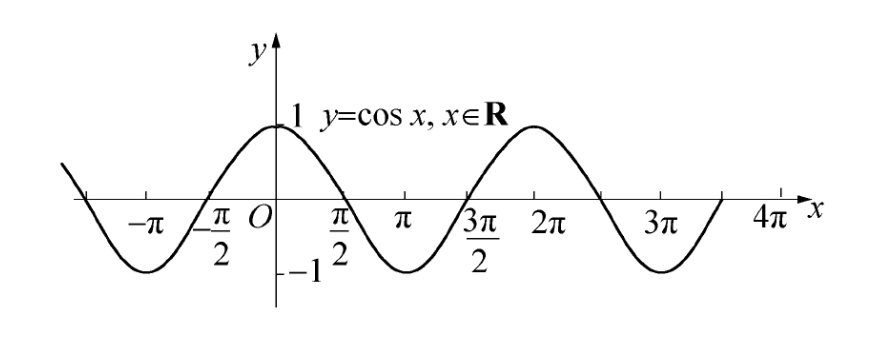

$y = \tan x$ 的定义域是 $\left \{ x | x \neq \frac{\pi}{2}+k \pi , k = 0 , \plusmn 1 ,\plusmn 2 , \cdots \right \}$，值域是 $(- \infty ,+ \infty)$，最小正周期是 $\pi$，在定义域上是奇函数：

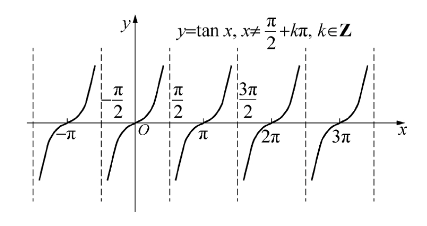

$y = \cot x$ 的定义域是 $\left \{ x | x \neq k \pi ,k = 0 , \plusmn 1 , \plusmn 2 , \cdots \right \}$，值域是 $(- \infty ,+ \infty)$，最小正周期是 $\pi$，它是奇函数：

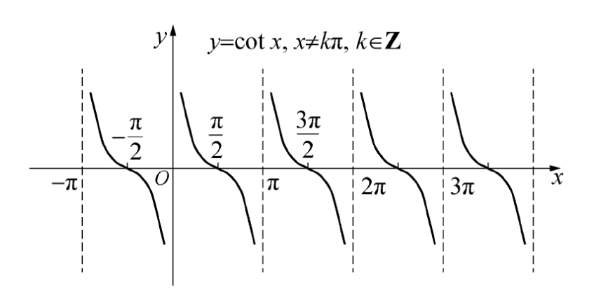

正割、余割函数与余弦、正弦函数的关系式为：

$$
y = \sec x = \frac{1}{\cos x} \\
y = \csc x = \frac{1}{\sin x}
$$

**反三角函数**

*定义1*　在区间 $[-\frac{\pi}{2},\frac{\pi}{2}]$ 上的正弦函数 $y = \sin x$ 的反函数记作 $y = \arcsin x$，定义域为 $[-1,1]$，值域为 $[-\frac{\pi}{2},\frac{\pi}{2}]$，称为 **反正弦函数**

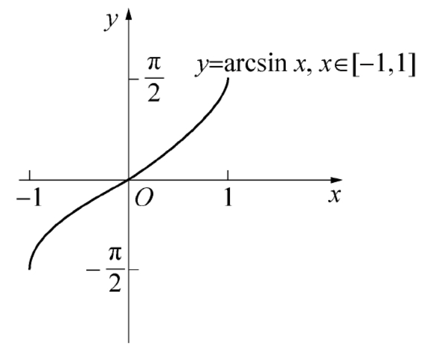

*定义2*　在区间 $[0,π]$ 上的余弦函数 $y = \cosx$ 的反函数记作 $y = \arccosx$，定义域为 $[-1,1]$，值域为 $[0,\pi]$，称为 **反余弦函数**

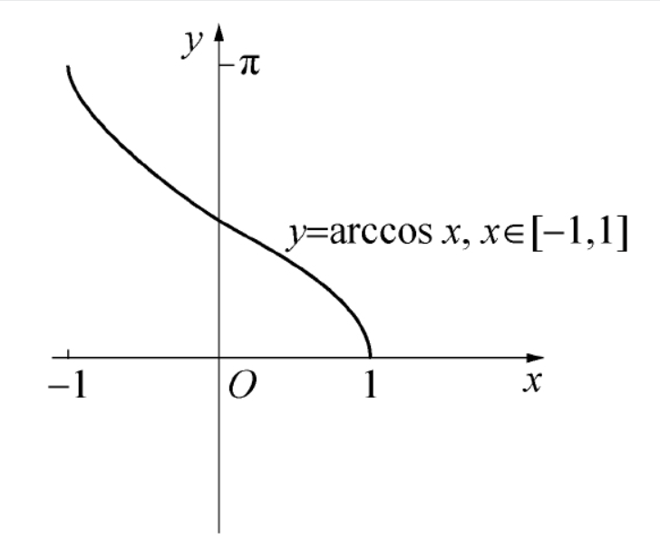

*定义3*　在区间 $(-\frac{\pi}{2},\frac{\pi}{2})$ 上的正切函数 $y = \tanx$ 的反函数记作 $y = \arctanx$，定义域是 $(-\infty,+\infty)$，值域为 $(-\frac{\pi}{2},\frac{\pi}{2})$，称为 **反正切函数**，在整个定义域上是单调递增函数；定义在区间 $(0,\pi)$上的余切函数 $y = \cotx$ 的反函数为 $y = \arccot x$，定义域是 $(-\infty,+\infty)$，值域为 $(0,\pi)，称为 **反余切函数**，在整个定义域上是单调递减函数

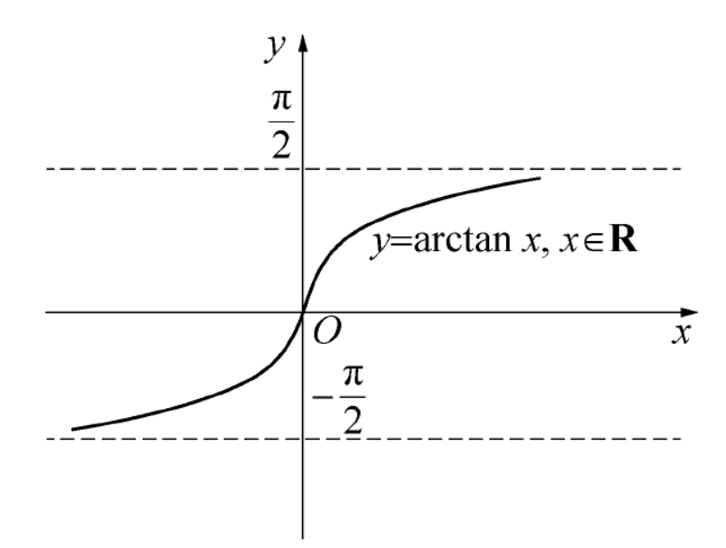

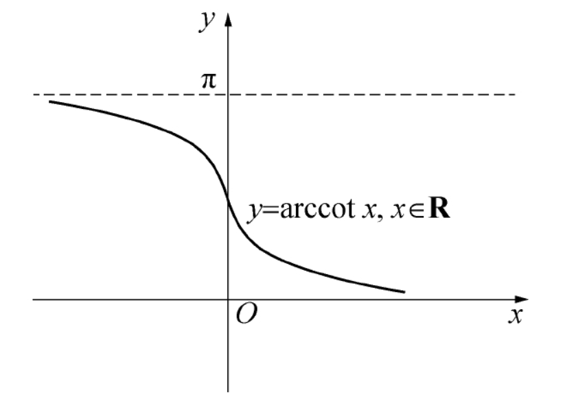

三角函数的反函数统称为 **反三角函数**

## 初等函数

> 把由常数和基本初等函数经过有限次的四则运算和有限次函数复合所构成的，并可以用一个算式表示的函数统称为 **初等函数**。

## 反函数

给定一个函数 $f$ ，在 $f$ 的值域中选择 $y$。在理想状况下，仅有一个 $x$ 值满足 $f(x)=y$。如果上述理想状况对于值域中的每一个 $y$ 来说都成立，那么就可以定义一个新的函数，它将逆转变换。从输出 $y$ 出发，这个新的函数发现一个且仅有一个输入 $x$ 满足 $f(x)=y$。这个新的函数称为 $f$ 的反函数，并写作 $f^{-1}$。

反函数的结论：

1. 从一个函数 $f$ 出发，使得对于在 $f$ 值域中的任意 $y$，都只有唯一的 $x$ 值满足 $f(x)=y$。也就是说，不同的输入对应不同的输出。
2. $f^{-1}$ 的定义域和 $f$ 的值域相同。
3. $f^{-1}$ 的值域和 $f$ 的定义域相同。
4. $f^{-1}(y)$ 的值就是满足 $f(x)=y$ 的 $x$。所以，如果 $f(x)=y$，那么 $f^{-1}(y)=x$。

## 奇函数和偶函数

> 如果对 $f$ 定义域里的所有 $x$ 有 $f(-x)=f(x)$，则 $f$ 是偶函数。同样地，当对 $f$ 定义域内所有 x 都有 $f(-x)=-f(x)$ 时，$f$ 是奇函数。

一般而言，一个函数可能是奇的，可能是偶的，也可能非奇非偶。

偶函数的图像关于 y 轴具有镜面对称性。

奇函数的图像关于原点有180°的点对称性

## 线性函数

形如 $f(x)=mx+b$ 的函数叫作线性函数，函数的斜率是 $m$。

**直线方程的*点斜式***

> 如果已知直线通过点 $(x_{0},y_{0})$，斜率为 $m$，则它的方程为 $y-y_{0}=m(x-x_{0})$

> 如果一条直线通过点 $(x_{1},y_{1})$ 和 $(x_{2},y_{2})$，则它的斜率等于 $\frac{y_{2}-y_{1}}{x_{2}-x_{1}}$

## 多项式

次数为 $n$ 的多项式的数学通式为

$$
p(x) = a_{n}x^{n}+a_{n-1}x^{n-1}+ \cdots +a_{2}x^{2}+a_{1}x^{1}+a_{0}
$$

1. $a_{n}$ 是基本项 $x_{n}$ 的倍数，叫作 $x_{n}$ 的系数
2. 最大的幂指数 n（该项系数不能为零）叫作多项式的次数

一般多项式根据首项系数正负以及多项式次数的奇偶就能判断图像两端的走势，图像两端走势共有如下四种情况：

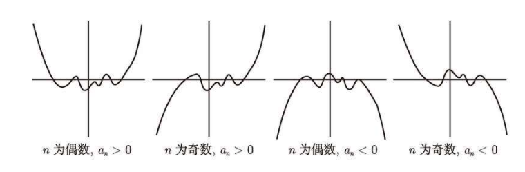

### 二次函数

> 二次函数是次数为 2 的多项式。二次函数一般写成如下：
> 
> $$
> p(x) = ax^2+bx+c
> $$

根据判别式的符号可以判断二次函数到底有两个、一个还是没有实数解。通常我们用希腊字母 $\Delta $ 来表示判别式 $\Delta =b^2-4ac$。它共有三种可能性。如果 $\Delta >0$，有两个不同的解；如果 $\Delta =0$，只有一个解，也可以说有两个相同的解；如果 $\Delta <0$，在实数范围内无解。对于前两种情况，解为

$$
\frac{-b \pm \sqrt{b^2-4ac}}{2a}
$$