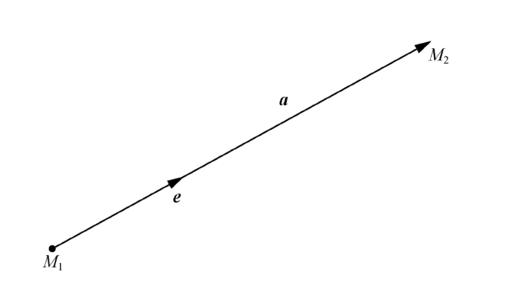
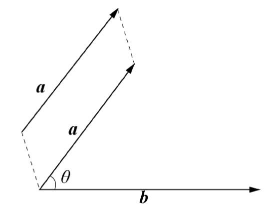
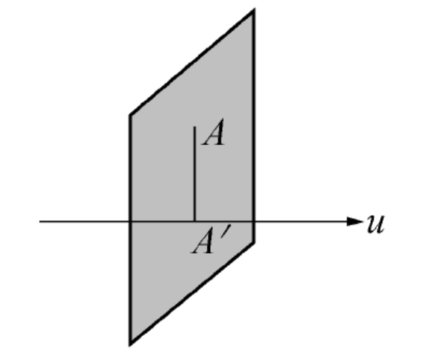
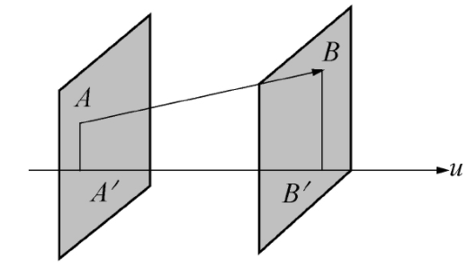

<!--
 * @Github       : https://github.com/superzhc/BigData-A-Question
 * @Author       : SUPERZHC
 * @CreateDate   : 2020-12-01 18:38:23
 * @LastEditTime : 2020-12-11 17:42:37
 * @Copyright 2020 SUPERZHC
-->
# 向量

既有大小又有方向的物理量称为 **向量**。在数学上可用有向线段来表示向量，其长度表示向量的大小，其方向（箭头）表示向量的方向。

**向量的表示**：以 $M_1$ 为起点、$M_2$ 为终点的有向线段表示的向量记为 $\overrightarrow{AB}$，有时也用一个黑体字母（书写时，在字母上面加一箭头）来表示（如下图所示），如 $\vec{a}$。

**向量的模**：向量的大小（数学上指有向线段的长度）叫作向量的模，记作 $|\vec{a}|$，$|\overrightarrow{M_1M_2}|$。模为 1 的向量称为单位向量（如上图所示），记作 $\vec{e}$。模为 0 的向量称为零向量，记作 $\vec{0}$。零向量的方向可以看作是任意的。

**向径**：以原点 $O$ 为始点，向一点 $M$ 引向量 $\overrightarrow{OM}$，这个向量叫作点 $M$ 对于点 $O$ 的向径，记作 $\vec{r}$，即 $\vec{r} = \overrightarrow{OM}$

**自由向量**：只与大小、方向有关，而与起点处无关的向量称为自由向量。

## 向量的运算

### 向量的投影及投影定理

将向量 $\vec{a}$、$\vec{b}$ 的始点重合，在两向量的所在平面上，若一个向量逆时针方向转过角度 $\theta$ 后可与另一个向量正向重合（如下图所示），则称 $\theta$ 为 **向量 $\vec{a}$、$\vec{b}$ 的夹角**，记作 $\widehat{a,b}$，即

$$
\theta = (\widehat{a,b}) = (\widehat{b,a})(0 \leqslant \theta \leqslant \pi)
$$

已知两向量 $\vec{a}$、$\vec{b}$，如果它们的夹角 $\theta = 0$ 或 $\theta = \pi$，则称这两个向量平行，记为 $\vec{a} // \vec{b}$，其中两个向量指向一致时 $\vec{a} = 0$，指向相反时 $\vec{a} = \pi$。指向相同的两个平行向量 $\vec{a}$、$\vec{b}$ 如果还满足 $|\vec{a}| = |\vec{b}|$，那么这两个向量相等，记为 $\vec{a} = \vec{b}$。与向量 $\vec{a}$ 的模相同，但方向相反的向量叫作 $\vec{a}$ 的负向量，记作 $- \vec{a}$。

通过空间一点 $A$ 作与 $u$ 轴垂直的平面（见下图），该平面与 $u$ 轴的交点 $A \prime$ 称为点 $A$ 在 $u$ 轴上的投影。

如果向量 $\overrightarrow{AB}$ 的始点 $A$ 与终点 $B$ 在 $u$ 轴上的投影分别为 $A \prime$、$B \prime$（见下图），则 $u$ 轴上的有向线段 $\overrightarrow{A \prime B \prime}$ 的值 $A \prime B \prime$ 称为向量 $\overrightarrow{AB}$ 在 $u$ 轴上的投影，记作 $Prj_u \overrightarrow{AB} = A \prime B \prime$，$u$ 轴称为投影轴。

**注**　值 $A \prime B \prime$ 是指其绝对值等于 $\overrightarrow{A \prime B \prime}$ 的长度，即 $|\overrightarrow{A \prime B \prime}|$，符号由 $\overrightarrow{A \prime B \prime}$ 的方向决定：当 $\overrightarrow{A \prime B \prime}$ 与 $u$ 轴同向时，取正号；当 $\overrightarrow{A \prime B \prime}$ 与 $u$ 轴反向时，取负号。

**定理 1**　向量 $\overrightarrow{AB}$ 在 $u$ 轴上的投影等于向量的模乘以 $u$ 轴与向量 $\overrightarrow{AB}$ 的夹角 $\theta$ 的余弦，即

$$
Prj_u \overrightarrow{AB} = |\overrightarrow{AB}| \cos \theta
$$

**定理 2**　两个向量的和在轴上的投影等于两个向量在轴上的投影的和

**定理 3**　$Prj_u(\lambda \vec{a}) = \lambda Prj_u \vec{a}$