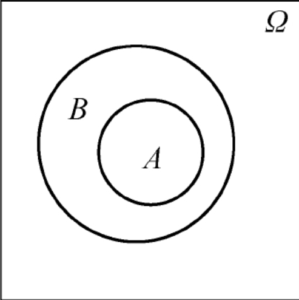
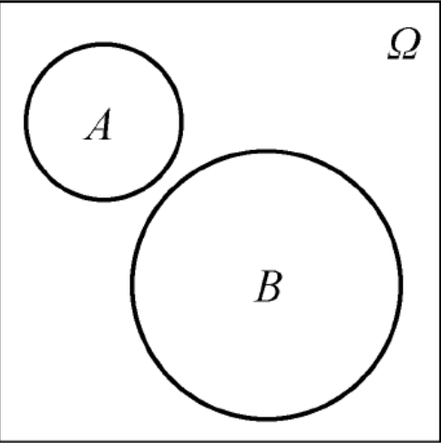
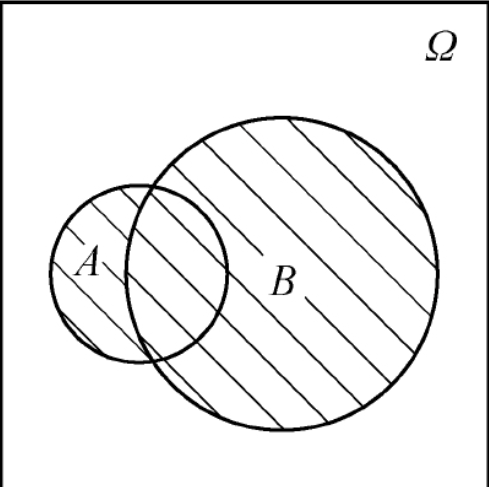
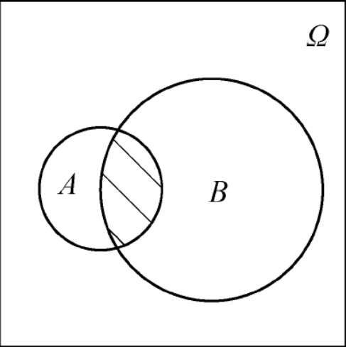
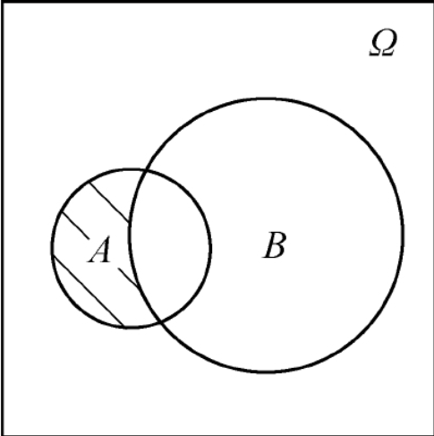
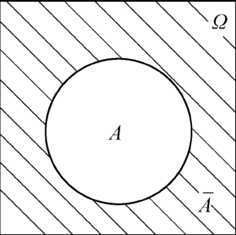

<!--
 * @Github       : https://github.com/superzhc/BigData-A-Question
 * @Author       : SUPERZHC
 * @CreateDate   : 2020-12-03 09:15:54
 * @LastEditTime : 2020-12-03 17:30:46
 * @Copyright 2020 SUPERZHC
-->
# 概率论

概率论是一门研究随机现象的统计规律性的数学学科。随机现象在一次试验中呈现不确定的结果，而在大量重复试验中结果将呈现某种规律性，例如相对比较稳定的性别比例，这种规律性称为 **统计规律性**。为了研究随机现象的统计规律性，就要对客观事物进行观察，观察的过程叫 **随机试验**（简称试验）。

**样本空间**

随机试验的一切可能结果组成的集合称为 **样本空间**，记为 $\Omega ={ \omega }$，其中 $\omega$ 表示试验的每一个可能结果，又称为 **样本点**，即样本空间为全体样本点的集合。

样本空间中的元素可以是数值，也可以不是数值。从样本空间中含有样本点的个数来看，可以是有限个也可以是无限个；可以是可列个也可以是不可列个。

当通过随机试验来研究随机现象时，每一次试验都只能出现 $\Omega$ 中的某一个结果 $\omega$，各个可能结果 $\omega$ 是否在一次试验中出现是随机的。这些在一次试验中可能出现，也可能不出现的一类结果称为 **随机事件**，简称为 **事件**，随机事件通常用大写字母 A，B，C，… 表示。

在事件的定义中，注意以下几个概念：

1. 任一随机事件 A 是样本空间 $\Omega$ 的一个子集；
2. 当试验的结果 $\omega$ 属于该子集时，就说事件 A 发生了．相反地，如果试验结果 $\omega$ 不属于该子集，就说事件 A 没有发生。例如，如果掷骰子掷出了 1，则事件 `A={1，3，5}` 发生，如果掷出 2，则事件 A 不发生；
3. 仅含一个样本点的随机事件称为 **基本事件**
4. 样本空间 $\Omega$ 也是自己的一个子集，所以它也称为一个事件．由于 $\Omega$ 包含所有可能的试验结果，所以 $\Omega$ 在每一次试验中一定发生，又称为 **必然事件**；
5. 空集 $\varnothing$ 也是样本空间 $\Omega$ 的一个子集，所以它也称为一个事件。由于 $\varnothing$ 中不包含任何元素，所以 $\varnothing$ 在每一次试验中一定不发生，又称为**不可能事件**。

## 随机事件间的关系

给定一个随机试验，$\Omega$ 是它的样本空间，A，B，C，… 都为 $\Omega$ 的子集，随机事件间的关系有以下几种．

1. 如果 $A \subset B$（或 $B \supset A$），则称事件 A 包含在 B 中（或称 B 包含 A），如下图所示。从概率论的角度来说：事件 A 发生必然导致事件 B 发生。

2. 如果 $A \subset B$，$B \subset A$ 同时成立，则称事件 A 与 B 相等，记为 $A=B$。从概率论的角度来说：事件 A 发生必然导致事件 B 发生，且 B 发生必然导致 A 发生，即 A 与 B 是同一个事件。

3. 如果 A 与 B 没有相同的样本点，则称事件 A 与 B 互不相容（或称为互斥），如下图所示。从概率论的角度来说：事件 A 与事件 B 不可能同时发生。

## 随机事件间的运算

随机事件的运算也有并、交、差和余四种运算。

- 事件 A 与 B 的并，记为 $A \cup B$，如下图所示，表示由事件 A 与 B 中所有样本点组成的新事件。从概率论的角度来说：事件 A 与 B 中至少有一个发生。

- 事件 A 与 B 的交，记为 $A \cap B$（或AB），如下图所示，表示由事件 A 与 B 中公共的样本点组成的新事件。从概率论的角度来说：事件 A 与 B 同时发生。

- 事件 A 与 B 的差，记为 $A-B$，如下图所示，表示由在事件 A 中且不在事件 B 中的样本点组成的新事件。从概率论的角度来说：事件 A 发生且 B 不发生。

- 事件 A 的对立事件（或称为逆事件、余事件），记为 $\bar{A}$，如下图所示。表示由 $\Omega$ 中且不在事件 A 中的所有样本点组成的新事件，即 $\bar{A }= \Omega - A$．从概率论的角度来说：事件 A 不发生。

从随机事件间的关系和运算中可以看出：

1. 对立事件一定是互不相容的事件，即 $A \cap \bar{A} = \varnothing$，但互不相容事件不一定是对立事件；
2. 根据差事件和对立事件的定义，事件 A 与 B 的差还可以表示成 $A - B = A\bar{B}$；
3. 必然事件 $\Omega$ 与不可能事件 $\varnothing$ 互为对立事件，即 $\bar{\Omega} = \varnothing$，$\bar{\varnothing}=\Omega$

**事件的运算定律**

1. 交换律：$A \cup B=B \cup A$，$A \cap B=B \cap A$
2. 结合律：$(A \cup B) \cup C=A \cup (B \cup C)$，$(AB)C=A(BC)$
3. 分配律：$(A \cup B) \cap C=AC \cup BC$，$(A \cap B) \cup C=(A \cup C) \cap (B\cup C)$
4. 对偶律：$\overline{A \cup B}=\bar{A} \cap \bar{B}$，$\overline{A \cap B}=\bar{A} \cup \bar{B}$ 
 
事件运算的对偶律是非常有用的公式，且以上的定律都可以推广到任意多个事件。

## 概率

在 $n$ 次试验中如果事件 A 出现了 $n_{A}$ 次，则称比值 $\frac{n_{A}}{n}$ 为这 $n$ 次试验中事件 A 出现的频率。记为 $f_{n}(A)=\frac{n_{A}}{n}$，$n_{A}$ 称为事件 A 发生的频数。概率的统计定义为：随着试验次数 $n$ 的增大，频率值逐步“稳定”到一个实数，这个实数称为事件 A 发生的概率。

概率的公理化定义如下：

> 设任一随机试验 $E$，$\Omega$ 为相应的样本空间，若对任意事件 $A$，有唯一实数 $P(A)$ 与之对应，且满足下面条件，则数 $P(A)$ 称为事件 $A$ 的概率：
> 
> 1. **非负性公理**　对于任意事件 $A$，总有 $P(A) \geq 0$；
> 2. **规范性公理** $P(\Omega)=1$；
> 3. **可列可加性公理**　若 $A_1,A_2, \cdots,A_n$ 为两两互不相容的事件，则有 
>   $$
>   P \left ( \bigcup_{i=1}^{\infty}A_{i} \right )=\sum_{i=1}^{\infty}P(A_{i})
>   $$

由概率的三条公理，可以得到以下概率的一些重要基本性质：

**性质1** $P(\varnothing)=0$

**性质2（有限可加性）**　设 $A_1,A_2, \cdots,A_n$ 为两两互不相容的事件，则有

$$
P \left ( \bigcup_{i=1}^{n}A_{i} \right )=\sum_{i=1}^{n}P(A_{i})
$$

**性质3**　对任意事件 A，有 $P(\bar{A})=1-P(A)$

证明：因为事件 $A$ 与 $\bar{A}$ 互不相容，且 $\Omega=A+\bar{A}$ 由规范性公理和性质2可知，$P(\Omega)=P(A)+P(\bar{A})$ 由此得证

**性质4**　若事件 $A \subset B$ 则 $P(B-A)=P(B)-P(A)$

证明：因为事件 $A \subset B$ 所以 $B=A \cup (B-A)$，且 $A$ 与 $B-A$ 互不相容，由性质 2 有限可加性得

$$
P(B)=P(A)+P(B-A)
$$

既得

$$
P(B-A)=P(B)-P(A)
$$

**推论**　若事件 $A \subset B$ 则 $P(A) \leq P(B)$

证明：由非负性公理得 $P(B-A)=P(B)-P(A) \geq 0$，因此 $P(A) \leq P(B)$

**性质5（减法公式）**　设 A，B 为任意事件，则 $P(A-B)=P(A)-P(AB)$

证明： $A-B=A-AB$，且 $AB \subset A$ 由性质4得

$$
P(A-B)=P(A-AB)=P(A)-P(AB)
$$

**性质6（加法公式）**　设 A，B 为任意事件，则 $P(A \cup B)=P(A)+P(B)-P(AB)$

证明：因为 $A \cup B=A \cup (B-AB)$，且 $A$ 与 $B-AB$ 互不相容，由性质2有限可加性得

$$
P(A \cup B)=P(A)+P(B-AB)=P(A)+P(B)-P(AB)
$$

还可以将性质6的加法公式推广到多个事件的情况．例如，设 A，B，C 为任意的三个事件，则

$$
P(A \cup B \cup C)=P(A)+P(B)+P(C)-P(AB)-P(AC)-P(BC)+P(ABC)
$$

更一般地，设 $A_1,A_2, \cdots ,A_n$ 为任意的 n 个事件，则

$$
P\left ( \bigcup_{i=1}^{n}A_{i} \right )=\sum_{i=1}^{n}P(A_{i})-\sum_{1 \leqslant i \leqslant j \leqslant n}P(A_{i}A_{j})+\sum_{1 \leqslant i \leqslant j \leqslant j \leqslant n}P(A_{i}A_{j}A_{k})+ \cdots +(-1)^{n+1}P(A_{1}A_{2} \cdots A_{n})
$$